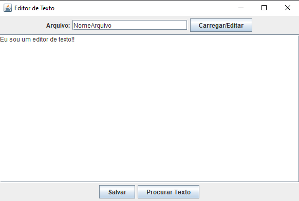

<h1 align= "center">
    <p>Editor de texto com IOProcess ⚙</p>
</h1>

<h1 align= "center"></h1>

## ❔ About
<p>Este é um editor de texto em Java utilizando processos de leitura e escrita de arquivo, além de uma interface utilizando swing. O sistema permite: carregar um arquivo de texto, editar o mesmo, procurar uma palavra e salvar o arquivo editado.</p>

## 🛠 Tools
<div align= "center">
    
    
</div>

## ♻ How to Setup

<p>Pré Requisitos:</p>

- `JDK 17`
- `Apache Maven 3.6.3 ou superior`
 <br>

```bash
    # clone o projeto
    $ git clone git@github.com:Zplinio18/texteditor-SO.git
```

```bash
    # na pasta raiz onde possui src e pom execute o comando (instala a pasta target)
    $ mvn clean install
```

```bash
    #  entre na pasta target
    $ cd target
```

```bash
    #  execute o programa
    $ java -jar TextEditorApp-1.0-SNAPSHOT-jar-with-dependencies.jar
```
